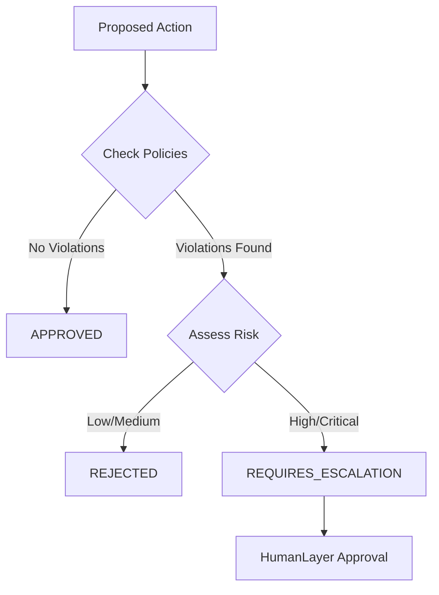

# CARF Guardian Policy Check Skill

## Purpose
Check if a proposed action passes CARF policy constraints before execution.
Uses the Guardian layer (Layer 4) for governance enforcement.

## When to Use
- Before high-risk operations (financial transactions, data modifications)
- When confidence is below threshold (< 0.85)
- For actions in `always_escalate` list
- To understand why an action was rejected

## Policy Categories

### Financial Policies
| Policy | Limit | Action |
|--------|-------|--------|
| `auto_approval_limit` | $100,000 | `require_escalation` |
| `daily_limit` | $500,000 | `reject` |
| `approved_vendors` | Whitelist | `reject` |

### Data Policies
| Policy | Description | Action |
|--------|-------------|--------|
| `pii_handling` | Must mask email/phone/ssn/address | `reject` |
| `data_residency` | us-east-1, eu-west-1 only | `reject` |
| `retention` | Max 90 days | `warn` |

### Operational Policies
| Policy | Limit | Action |
|--------|-------|--------|
| `max_reflection_attempts` | 3 | `escalate` |
| `timeout` | 300 seconds | `abort` |
| `rate_limiting` | 60 calls/min | `throttle` |

### Risk Thresholds
| Policy | Threshold | Action |
|--------|-----------|--------|
| `confidence_threshold` | 0.85 | `escalate` |
| `entropy_alert` | 0.9 | `circuit_break` |

### Always Escalate Actions
The following actions **always** require human approval:
- `delete_data`
- `modify_policy`
- `external_api_write`
- `production_deployment`

## Execution Steps

### 1. Check via Python

```python
from src.workflows.guardian import get_guardian

guardian = get_guardian()
decision = guardian.evaluate(state)

print(f"Verdict: {decision.verdict}")
print(f"Violations: {decision.violations}")
print(f"Risk Level: {decision.risk_level}")
```

### 2. Check via API Response

Policy check results are included in `/query` response:

```json
{
  "guardian_result": {
    "verdict": "approved",
    "policies_passed": 5,
    "policies_total": 5,
    "risk_level": "low",
    "violations": []
  }
}
```

### 3. Manual Policy Lookup

Check policy values in configuration:

```yaml
# config/policies.yaml
financial:
  auto_approval_limit:
    value: 100000
    currency: "USD"
    action: "require_escalation"
```

## Guardian Decision Flow



## Verdict Types

| Verdict | Meaning | Next Step |
|---------|---------|-----------|
| `approved` | All policies passed | Execute action |
| `rejected` | Policy violated, fixable | Go to Reflector |
| `requires_escalation` | Human approval needed | HumanLayer flow |

## OPA Integration (Optional)

If `OPA_ENABLED=true`, Guardian also checks OPA policies:

```bash
# Environment
OPA_URL=http://localhost:8181
OPA_POLICY_PATH=/v1/data/carf/guardian/allow

# Test OPA policy
curl http://localhost:8181/v1/data/carf/guardian/allow \
  -d '{"input": {"action": "delete_data", "confidence": 0.9}}'
```

## Troubleshooting

### Unexpected Rejection
1. Check `violations` list in response
2. Review `config/policies.yaml` for limits
3. Verify action type isn't in `always_escalate`

### Override Rejected Action
- Requires human approval via HumanLayer
- Cannot bypass Guardian programmatically
- See `AGENTS.md` for modification protocol

### Policy File Not Loading
- Check file exists: `config/policies.yaml`
- Guardian uses defaults if file missing
- Review `guardian.py:_set_default_policies()`
