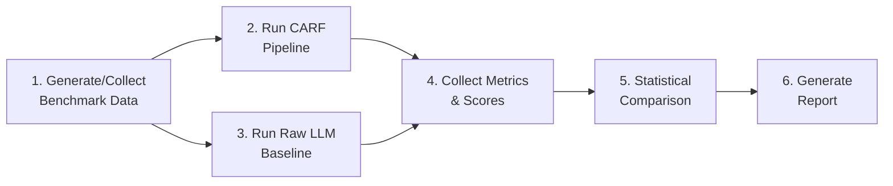

# CARF Benchmarking Strategy: LLM-only vs. CARF Architecture

**Date**: 2026-02-17  
**Purpose**: Comprehensive benchmarking framework to evaluate CARF (CYNEPIC) against raw LLM usage across technical dimensions and identified use cases.

---

## 1. The Core Question

> **"Does wrapping LLM capabilities inside a Cynefin-routed, causal-Bayesian, policy-gated architecture (CARF) produce measurably better outcomes than using LLMs directly?"**

To answer this, we need benchmarks at **two levels**:

| Level | What It Measures | Key Question |
|-------|-----------------|--------------|
| **Technical** | Component-level accuracy, latency, cost, safety | Is each CARF subsystem (router, causal engine, Bayesian, Guardian) better than an LLM doing the same job? |
| **Use-Case** | End-to-end decision quality in real scenarios | Does CARF deliver more trustworthy, actionable decisions in supply chain, finance, sustainability, etc.? |

---

## 2. Technical Benchmarks (Component-Level)

### 2.1 Cynefin Router Classification

**What to benchmark**: Can the router correctly classify problem complexity?

| Benchmark / Method | Description | How to Apply |
|---------------------|-------------|-------------|
| **Custom Cynefin Test Suite** (build it) | 500+ labeled queries across 5 domains (Clear, Complicated, Complex, Chaotic, Disorder), spanning multiple industries | Compare CARF router (LLM + entropy) vs. raw LLM (GPT-4/DeepSeek) prompted with domain descriptions |
| **DistilBERT vs. LLM A/B** (already planned) | Use `scripts/evaluate_router_model.py` to compare DistilBERT vs. LLM classification | Measure **weighted F1**, **confusion matrix** (esp. Complicated↔Complex boundary), **latency** |
| **Domain Adaptation Sets** | 100-300 domain-specific queries per vertical (finance, supply chain, healthcare) | Measure accuracy degradation across domains |

**Metrics**: Accuracy, Weighted F1, Confusion Matrix, Classification Latency (ms), Confidence Calibration (ECE — Expected Calibration Error)

**How to run it**:
```bash
# Generate labeled test set
python scripts/generate_router_training_data.py --count 500 --output data/benchmark/router_test.jsonl

# Evaluate both modes
python scripts/evaluate_router.py --test-set data/benchmark/router_test.jsonl --modes llm,distilbert

# Compare with raw LLM (no CARF)
python scripts/benchmark_raw_llm_router.py --test-set data/benchmark/router_test.jsonl
```

---

### 2.2 Causal Inference Engine

**What to benchmark**: ATE estimation accuracy, DAG discovery, and refutation robustness

| Benchmark / Dataset | Source | What It Tests |
|---------------------|--------|---------------|
| **CSuite** | [GitHub - causal-suite](https://github.com/causal-learn/csuite) | Synthetic causal graphs with known ground truth — ATE & CATE estimation |
| **RealCause** | [OpenReview](https://openreview.net/forum?id=...) | Semi-synthetic datasets (Lalonde Jobs, IHDP, Twins) with realistic DGPs |
| **IBM Causal Benchmarking Framework** | [Synapse.org](https://synapse.org) | Real-world covariates + simulated treatment/outcomes (LBIDD dataset) |
| **CausalPitfalls** | [Kaggle](https://kaggle.com) | 75 CSV files testing common causal reasoning errors |
| **DoWhy Refutation API** | Built-in to CARF | Placebo, random common cause, data subset refutation tests |

**Key Metrics**:

| Metric | Description | Target |
|--------|-------------|--------|
| **ATE MSE** | Mean Squared Error of estimated vs. true Average Treatment Effect | Lower is better |
| **Wasserstein Distance** | Distribution-level comparison of estimated vs. true ATE | < 0.1 |
| **Refutation Pass Rate** | % of refutation tests that confirm the estimate | ≥ 80% |
| **DAG F1** (Structural) | Precision/Recall of discovered edges vs. ground truth DAG | ≥ 0.7 |
| **KL Divergence** | For GCM evaluation (DoWhy `gcm` module) | Lower is better |

**CARF vs. Raw LLM comparison**:
1. Give the same dataset to a raw LLM with the prompt: *"Estimate the causal effect of X on Y controlling for Z"*
2. Run the same query through CARF's DoWhy/EconML pipeline
3. Compare ATE accuracy, confidence interval coverage, and refutation outcomes

---

### 2.3 Bayesian Inference Engine

**What to benchmark**: Posterior accuracy, calibration, and uncertainty quantification

| Benchmark / Method | Description | How to Apply |
|---------------------|-------------|-------------|
| **posteriordb** | Reference Monte Carlo draws for 100+ models across PyMC/Stan/Pyro | Compare CARF's PyMC posteriors against reference posteriors |
| **Simulation-Based Calibration (SBC)** | Generate data from known priors → fit → check posterior coverage | Run 500+ SBC iterations on CARF's Bayesian service |
| **Posterior Predictive Checks (PPC)** | Generate predictions from posterior → compare to observed data | Already supported in PyMC; add automated PPC scoring |

**Key Metrics**:

| Metric | Description | Target |
|--------|-------------|--------|
| **Posterior Coverage** | % of true values within 95% credible intervals | ≥ 90% |
| **CRPS** (Continuous Ranked Probability Score) | Calibration of full posterior distribution | Lower is better |
| **Divergence Count** | MCMC sampling issues (divergent transitions) | 0 |
| **R-hat** | Chain convergence diagnostic | < 1.01 |
| **ESS** (Effective Sample Size) | Sampling efficiency | > 400 per chain |

**CARF vs. Raw LLM comparison**:
1. Ask LLM: *"Given 42 successes in 100 trials, what is the likely conversion rate and uncertainty?"*
2. Run same through CARF Bayesian service
3. Compare: Does the LLM give calibrated uncertainty? Does it distinguish epistemic vs. aleatoric uncertainty?

---

### 2.4 Guardian Policy Layer

**What to benchmark**: Policy enforcement accuracy, false positive/negative rate, escalation appropriateness

| Test Category | Setup | Success Criteria |
|---------------|-------|-----------------|
| **Policy Compliance** | 100 scenarios with known policy violations | 100% detection rate (fail-closed) |
| **False Positive Rate** | 100 compliant scenarios | < 5% false rejections |
| **Escalation Accuracy** | 50 borderline cases | Human agrees with escalation ≥ 90% |
| **CSL-Core Determinism** | Same input → same verdict (100 repetitions) | 100% consistency |
| **EU AI Act Checklist** | Map CARF outputs against Article 13-15 requirements | ≥ 90% coverage |

**CARF vs. Raw LLM comparison**: Give same policy scenarios to an LLM and ask it to enforce policy → measure consistency and miss rate.

---

### 2.5 End-to-End System Performance

| Metric | Description | How to Measure |
|--------|-------------|---------------|
| **Latency (P50/P95/P99)** | Full pipeline response time | `GET /health` + `/query/transparent` timing |
| **Cost per Query** | LLM tokens + compute | Agent Tracker `GET /agents/stats` |
| **Hallucination Rate** | DeepEval hallucination risk across all responses | `tests/deepeval/` suite — aggregate |
| **Human Escalation Rate** | % queries requiring human intervention | `GET /escalations` count / total queries |
| **Self-Healing Success** | % of Guardian rejections resolved by Reflector (without human) | Audit log analysis |

**CARF vs. Raw LLM comparison** — use the **CLEAR Framework** (2025):

| Dimension | CARF Measurement | Raw LLM Measurement |
|-----------|-----------------|---------------------|
| **Cost** | Tokens + compute + infrastructure | Tokens only |
| **Latency** | Full pipeline time | Single LLM call time |
| **Efficiency** | Queries resolved without human intervention | N/A (no escalation) |
| **Assurance** | Audit trail completeness, policy coverage | None |
| **Reliability** | Consistency across repeated queries (same input → same domain → same verdict) | LLM non-determinism |

---

## 3. Use-Case Benchmarks (Scenario-Level)

### 3.1 Supply Chain Resilience

**Scenario**: Already implemented in CARF demo — `Supply Chain Resilience`

| Benchmark Task | CARF Approach | Raw LLM Approach | Success Metric |
|----------------|---------------|-------------------|---------------|
| Identify disruption risk factors | Causal DAG discovery → ATE of `climate_stress_index` on `disruption_risk_percent` | Prompt: *"What factors drive supply chain disruption?"* | ATE accuracy vs. ground truth |
| What-if scenario simulation | `/simulations/run` with interventions | Prompt: *"If we increase supplier diversity by 20%, what happens?"* | Predicted outcome accuracy |
| Risk escalation | Guardian detects high-risk action → HumanLayer | LLM decides on its own | False negative rate on dangerous actions |

**Dataset**: Use `generate_chain_data.py` + CSuite supply chain configs

---

### 3.2 Financial Risk & Discount Impact

**Scenario**: Already implemented — `Discount vs Churn`

| Benchmark Task | CARF Approach | Raw LLM Approach | Success Metric |
|----------------|---------------|-------------------|---------------|
| Estimate discount effect on churn | DoWhy ATE + refutation tests | Prompt: *"Does offering a discount reduce churn?"* | ATE MSE, refutation pass rate |
| Budget policy enforcement | Guardian: *"Require human approval for >$1M decisions"* | LLM self-assessment | Policy violation detection rate |
| Uncertainty communication | Bayesian confidence intervals + epistemic markers | LLM verbal confidence (*"I'm fairly confident..."*) | Calibration (PPC checks) |

**Datasets**: Custom synthetic (existing demo) + IBM Causal Benchmark data

---

### 3.3 Sustainability / Scope 3 Attribution

**Scenario**: Already implemented — `Scope 3 Attribution`

| Benchmark Task | CARF Approach | Raw LLM Approach | Success Metric |
|----------------|---------------|-------------------|---------------|
| Attribute emissions to suppliers | Causal DAG + effect estimation | Prompt: *"Which suppliers contribute most to Scope 3?"* | ATE accuracy, DAG F1 |
| Renewable energy ROI | `/simulations/compare` multi-scenario | Prompt: *"Is investing in renewables worth it?"* | Prediction accuracy vs. historical outcomes |
| EU AI Act compliance reporting | `/transparency/compliance` endpoint | Manual prompt engineering | Completeness of Article 13-15 requirements |

---

### 3.4 Critical Infrastructure / Emergency Response

**Scenario**: Tests the Chaotic domain path

| Benchmark Task | CARF Approach | Raw LLM Approach | Success Metric |
|----------------|---------------|-------------------|---------------|
| Crisis detection & circuit breaker activation | Entropy spike → Chaotic routing → circuit breaker → human escalation | LLM processes normally | Time to human notification, false alarm rate |
| Load shedding decision | Guardian policy + HumanLayer approval | LLM gives recommendation | Decision safety (no unilateral dangerous action) |
| Post-crisis analysis | Session lineage tracking + audit trail | Chat history only | Audit completeness |

---

### 3.5 Healthcare / Medical Decision Support (Future Use-Case)

| Benchmark Task | CARF Approach | Raw LLM Approach | Success Metric |
|----------------|---------------|-------------------|---------------|
| Treatment effect estimation | DoWhy with IHDP dataset | LLM prompt with clinical data description | ATE MSE on IHDP benchmark |
| Diagnostic uncertainty | Bayesian posterior with evidence updates | LLM verbal confidence | Posterior calibration (SBC) |
| Patient safety policy | Guardian: *"Always escalate cancer treatment decisions"* | LLM self-judgment | Escalation compliance rate |

---

## 4. How to Execute the Benchmarking

### 4.1 Proposed Test Harness Architecture

```
benchmarks/
├── technical/
│   ├── router/
│   │   ├── test_set.jsonl          # 500+ labeled queries
│   │   ├── benchmark_router.py     # CARF vs LLM comparison
│   │   └── results/
│   ├── causal/
│   │   ├── csuite_configs/         # CSuite benchmark data
│   │   ├── realcause_data/         # Semi-synthetic datasets
│   │   ├── benchmark_causal.py     # ATE accuracy comparison
│   │   └── results/
│   ├── bayesian/
│   │   ├── posteriordb_models/     # Reference posteriors
│   │   ├── benchmark_bayesian.py   # Calibration checks
│   │   └── results/
│   └── guardian/
│       ├── policy_test_cases.yaml  # Compliance scenarios
│       ├── benchmark_guardian.py   # Consistency tests
│       └── results/
├── use_cases/
│   ├── supply_chain/
│   ├── financial_risk/
│   ├── sustainability/
│   ├── critical_infra/
│   └── benchmark_e2e.py            # End-to-end scenario runner
├── baselines/
│   └── raw_llm_baseline.py         # Same queries → raw LLM
└── reports/
    └── generate_report.py          # Aggregated comparison report
```

### 4.2 Execution Steps



**Step 1 — Data Collection** (1-2 weeks):
- Generate Cynefin router test set (500+ queries, human-labeled)
- Download CSuite and RealCause datasets for causal benchmarking
- Create posteriordb model configs for Bayesian benchmarking
- Build Guardian policy test scenarios

**Step 2 — CARF Pipeline Run** (2-3 days):
- Run all benchmark queries through the full CARF pipeline
- Capture per-step metrics via Agent Tracker + DeepEval
- Log all Guardian verdicts and escalation decisions

**Step 3 — Raw LLM Baseline** (1-2 days):
- Send identical queries to a raw LLM (GPT-4 / DeepSeek) with appropriate prompts
- Parse structured outputs for comparison
- No policy enforcement, no causal engine, no Bayesian — just LLM

**Step 4 — Metrics Collection** (automated):
- Aggregate all evaluation scores from DeepEval
- Compute ATE MSE, DAG F1, posterior coverage, latency percentiles
- Track cost per query for both approaches

**Step 5 — Statistical Comparison** (1-2 days):
- Paired t-tests or Wilcoxon signed-rank tests for accuracy differences
- Bootstrap confidence intervals on key metrics
- Effect size reporting (Cohen's d)

**Step 6 — Report Generation** (1 day):
- Automated comparison tables and charts
- Executive summary with recommendations

---

### 4.3 Key Comparison Table Template

| Dimension | Metric | CARF Score | Raw LLM Score | Δ | Winner |
|-----------|--------|-----------|---------------|---|--------|
| **Router Accuracy** | Weighted F1 | _TBD_ | _TBD_ | | |
| **Causal ATE** | MSE | _TBD_ | _TBD_ | | |
| **Causal Robustness** | Refutation Pass % | _TBD_ | N/A | | |
| **Bayesian Calibration** | Coverage 95% CI | _TBD_ | _TBD_ | | |
| **Hallucination Rate** | DeepEval avg. | _TBD_ | _TBD_ | | |
| **Policy Enforcement** | Detection Rate | _TBD_ | _TBD_ | | |
| **Latency** | P95 (ms) | _TBD_ | _TBD_ | | |
| **Cost** | $/1000 queries | _TBD_ | _TBD_ | | |
| **Audit Completeness** | % traceable decisions | _TBD_ | N/A | | |
| **Human Escalation Rate** | % queries escalated | _TBD_ | N/A | | |

---

## 5. Expected CARF Advantages (Hypotheses)

These are the key hypotheses the benchmarking should validate or refute:

> [!IMPORTANT]
> The following are **hypotheses** to be tested, not guaranteed outcomes.

1. **Causal accuracy**: CARF's DoWhy engine will produce ATE estimates with **≥50% lower MSE** than raw LLM causal reasoning on CSuite/RealCause datasets
2. **Uncertainty calibration**: CARF's Bayesian service will achieve **≥90% posterior coverage** while LLM verbal confidence will be poorly calibrated (~60-70%)
3. **Safety**: CARF's Guardian will achieve **100% policy violation detection**, while LLM-only will miss **>20%** of policy boundaries
4. **Consistency**: CARF will produce deterministic Guardian verdicts (**100% reproducibility**), while LLM outputs will vary across repetitions
5. **Audit compliance**: CARF will meet **≥90% of EU AI Act Article 13-15 requirements**, while raw LLM will meet **<30%** without additional tooling
6. **Latency trade-off**: CARF will be **2-5x slower** per query but the quality/safety gain justifies this cost
7. **Hallucination reduction**: CARF's structured pipeline will reduce hallucination risk by **≥40%** (DeepEval metric)

---

## 6. Recommended Benchmark Tools & Libraries

| Tool | Purpose | Integration |
|------|---------|-------------|
| **DeepEval** | LLM output quality scoring | Already integrated in CARF |
| **posteriordb** | Reference Bayesian posteriors | `pip install posteriordb` |
| **CSuite** | Causal ML benchmark datasets | `pip install csuite` |
| **DoWhy Refutation API** | Causal robustness validation | Already integrated in CARF |
| **ArviZ** | Bayesian diagnostics (R-hat, ESS, PPC) | Already used with PyMC |
| **CLEAR Framework** | Multi-dimensional agent evaluation | Manual scoring methodology |
| **AgentBench** | Agentic AI benchmark suite | Optional — for broader comparison |
| **LangSmith** | Tracing & evaluation at scale | Already configured in CARF |

---

## 7. Summary: What CARF Brings That LLMs Cannot

| Capability | Raw LLM | CARF |
|-----------|---------|------|
| Causal reasoning with refutation | Correlational guessing | Structural causal models (DoWhy) |
| Calibrated uncertainty | Verbal confidence ("I'm fairly sure") | Bayesian posterior distributions |
| Policy enforcement | Suggestions only | Deterministic Guardian + OPA |
| Domain-appropriate reasoning | One-size-fits-all | Cynefin-routed to right analytical engine |
| Audit trail | Chat history | Full decision lineage (Kafka/Neo4j) |
| Human-in-the-loop governance | None | HumanLayer SDK with approval gates |
| Self-healing on rejection | None | Reflector loop + bounded retries |
| EU AI Act compliance | Minimal | Built-in compliance reporting |
