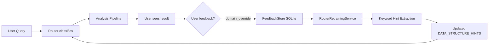

# How CARF Addresses Recursive Self-Improvement (RSI)

**A Deep Architecture-Level Analysis**

> This document maps every major RSI mechanism identified in current AI safety research to concrete CARF subsystems, evaluating what exists, what is partially addressed, and what represents an intentional design boundary.

---

## Executive Summary

CARF's architecture embodies a fundamentally **safety-first, bounded** approach to recursive self-improvement. Rather than pursuing unbounded RSI — where an AI system autonomously modifies its own core architecture in an unconstrained loop — CARF implements what we term **Supervised Recursive Refinement (SRR)**: a system where improvement cycles exist but are bounded by formal invariants, policy enforcement, human oversight gates, and audit trails at every layer.

The table below provides a quick mapping before diving into detail:

| RSI Mechanism | CARF Subsystem | Status |
|---|---|---|
| **Self-Repair / Self-Correction** | Smart Reflector (hybrid heuristic + LLM) | ✅ Implemented |
| **Meta-Learning / Learning to Learn** | Agent Memory (Reflexion-weighted recall), Router memory hints | ✅ Implemented |
| **Self-Modification Modules** | Router Retraining Pipeline + Feedback API | ✅ Implemented (bounded) |
| **Evaluator Component** | EvaluationService (DeepEval + heuristic), Guardian | ✅ Implemented |
| **Tool Use & Code Execution** | MCP Server (18 cognitive tools) | ✅ Implemented |
| **Multi-Agent Collective Improvement** | LangGraph cognitive mesh (4 domain agents + Guardian + Reflector) | ✅ Implemented |
| **Containment & Safety Bounds** | TLA+ formal verification, Guardian, CSL-Core, max_reflections | ✅ Implemented |
| **Human Oversight Gates** | HumanLayer integration, 3-point escalation context | ✅ Implemented |
| **Bias Amplification Prevention** | Guardian risk decomposition, refutation testing, domain-aware thresholds, BiasAuditor (Phase 18B) | ✅ Implemented |
| **Formal Verification of Self-Modifications** | TLA+ specs for StateGraph + EscalationProtocol | ✅ Implemented |
| **Unbounded Architecture Modification** | — | 🚫 Intentionally excluded |

---

## 1. Self-Repair and Self-Correction

### The RSI Concept
A system that can diagnose its own errors, generate patches, and execute corrections — creating a primitive self-debugging loop.

### CARF's Implementation: The Smart Reflector

CARF's [smart_reflector.py](file:///c:/Users/35845/Desktop/DIGICISU/projectcarf/src/services/smart_reflector.py) implements a **three-strategy self-correction system** triggered when the Guardian layer rejects a proposed action:

```
Guardian REJECTS → Reflector → [Heuristic Repair | LLM Repair | Hybrid] → Re-route to Router
```

**Strategy hierarchy:**

| Strategy | Speed | Scope | How it works |
|---|---|---|---|
| **Heuristic** | Sub-ms | Known violation patterns | Budget → 20% reduction, threshold → 10% safety margin, approval → flag for human review |
| **LLM** | ~1s | Unrecognized violations | Contextual repair via `get_chat_model()` with structured JSON output |
| **Hybrid** (default) | Variable | Full coverage | Heuristic first; if confidence < 0.7 or violations remain, fallback to LLM |

**Critical RSI safety feature:** The reflector loop is **formally bounded** by `max_reflections` (default: 2) in `EpistemicState`. After exhausting reflection attempts, the system **escalates to a human** rather than continuing to self-modify. This is verified by TLA+ safety invariant S2:

> *"Reflector loops bounded by `MaxReflections`"*

The [reflector_node](file:///c:/Users/35845/Desktop/DIGICISU/projectcarf/src/workflows/graph.py#L549-L634) in the LangGraph workflow stores full repair provenance:
- Original action preserved in `context["original_action"]`
- Each repair attempt logged with strategy used, success/failure, and violation details
- Repair history accumulated in `context["guardian_rejections"]` for downstream learning

### RSI Alignment Assessment
This is a **narrow, constrained** form of self-correction. The system cannot modify its own code, model weights, or architecture. It can only adjust *proposed actions* within the bounds of its existing repair heuristics and the LLM's contextual suggestions. The improvement scope is intentionally limited to the *output layer*, not the *reasoning layer*.

---

## 2. Meta-Learning and Experiential Memory

### The RSI Concept
Systems trained not just on tasks, but on the *process of improving their learning* — using past experiences to enhance future performance.

### CARF's Implementation: Dual-Layer Memory Architecture

CARF implements experiential learning through two complementary systems:

#### 2a. Agent Memory (Persistent, Reflexion-Weighted)

[agent_memory.py](file:///c:/Users/35845/Desktop/DIGICISU/projectcarf/src/services/agent_memory.py) provides **cross-session persistent memory** with a key RSI-relevant feature — **Reflexion scoring**:

```python
# Reflexion: weight by quality score if available
adjusted = score
if entry.quality_score is not None:
    adjusted = score * (0.5 + 0.5 * entry.quality_score)
```

This means the system **learns to prioritize high-quality past analyses** when recalling similar experiences. Low-quality past results (as scored by users or the evaluation service) are downweighted in future retrieval. This is a concrete form of **meta-learning**: the system doesn't just remember past results, it learns *which of its past results were good* and preferentially applies those patterns.

**Memory → Router feedback loop:**
1. Each completed analysis is stored via `store_from_state()` (domain, confidence, verdict, method)
2. On new queries, `get_context_augmentation()` retrieves similar past analyses
3. The Router receives these as `_memory_augmentation` soft signals
4. Similar past queries with high similarity (>0.3) create **domain vote hints** that nudge routing

#### 2b. Experience Buffer (Volatile, Session-Scoped)

[experience_buffer.py](file:///c:/Users/35845/Desktop/DIGICISU/projectcarf/src/services/experience_buffer.py) provides in-session semantic memory using sentence-transformers (all-MiniLM-L6-v2) or TF-IDF fallback, with built-in pattern aggregation:

- `find_similar()` — cosine similarity retrieval of past analyses
- `get_domain_patterns()` — aggregate statistics per Cynefin domain
- `to_context_augmentation()` — format past knowledge for router injection

### RSI Alignment Assessment
This dual-layer memory constitutes a **bounded meta-learning loop**: the system improves its routing accuracy and retrieval quality over time without human intervention, but the improvement is capped by the `deque(maxlen=1000)` buffer limit and the JSONL file store's `max_entries=10000`. The memory influences *soft signals* in routing, never hard overrides. Memory hints carry only a **0.03 weight boost** — deliberately small to prevent runaway memory-driven drift.

---

## 3. Self-Modification Modules (Generate → Evaluate → Validate)

### The RSI Concept
Architectures where one component proposes modifications, another validates them, within a closed loop.

### CARF's Implementation: Feedback → Retraining Pipeline

CARF implements an explicit **generate-evaluate-validate** self-modification loop for its Router classifier:



The pipeline consists of three decoupled components:

1. **[Feedback API](file:///c:/Users/35845/Desktop/DIGICISU/projectcarf/src/api/routers/feedback.py)** — Collects `domain_override` corrections (user says "this should have been Complicated, not Complex"), persisted in SQLite with full provenance (session ID, original domain, query text, timestamp)

2. **[Router Retraining Service](file:///c:/Users/35845/Desktop/DIGICISU/projectcarf/src/services/router_retraining_service.py)** — Extracts frequent terms per corrected domain from override feedback, producing keyword hints for router pattern matching. Includes readiness checks: requires ≥10 overrides with ≥3 per domain before triggering retraining.

3. **DistilBERT Retraining Path** — The Router supports dual-mode classification (LLM vs. DistilBERT). The feedback-to-JSONL export pipeline enables fine-tuning the DistilBERT classifier on corrected examples, creating a concrete path for **model self-improvement from production data**.

### RSI Alignment Assessment
This is a **human-supervised self-modification** pipeline. Key safety features:
- The retraining is **non-destructive**: keyword hints are extracted but not automatically applied
- The `/feedback/retrain-router` endpoint explicitly states "does not modify the running router directly"
- Readiness thresholds prevent premature retraining on insufficient data
- The entire pipeline requires human triggering — no autonomous self-modification

---

## 4. Multi-Agent Collective Improvement

### The RSI Concept
RSI emerging from agent-agent interaction — critic agents evaluating worker agents, knowledge exchange, parameter merging.

### CARF's Implementation: The LangGraph Cognitive Mesh

CARF's [StateGraph](file:///c:/Users/35845/Desktop/DIGICISU/projectcarf/src/workflows/graph.py) is a multi-agent system where specialized agents critique and constrain each other:

```
Router → RAG Context → CSL Precheck → [Domain Agent] → Guardian → [Governance] → END
                                                         ↓ (REJECTED)
                                                       Reflector → Router (retry)
                                                         ↓ (ESCALATE)
                                                       Human → Router/END
```

**Agent roles in the improvement loop:**

| Agent | Role | RSI Function |
|---|---|---|
| **Router** | Classifier | Routes work; learns from memory hints |
| **Domain Agents** (4) | Worker agents | Produce analyses (causal, Bayesian, deterministic, emergency) |
| **Guardian** | Critic agent | Evaluates all outputs against policies; produces decomposed risk scores |
| **Reflector** | Repair agent | Attempts self-correction on rejected actions |
| **Governance** | Auditor | MAP-PRICE-RESOLVE — tracks cross-domain impacts, computes costs, detects conflicts |
| **EvaluationService** | Quality judge | DeepEval scoring at each node (relevancy, hallucination, reasoning depth, UIX compliance) |

**Critical multi-agent dynamics:**
- Guardian criticism feeds back through Reflector to domain agents via `context["guardian_rejections"]`
- Each rejection carries structured repair metadata that domain agents can use to adapt
- The Governance node creates **semantic triples** from analysis results that feed back into the RAG index
- The Evaluation Service flags high hallucination risk outputs (>0.3) for human review

### RSI Alignment Assessment
This is a **structured critic-worker-auditor** architecture, not an unconstrained multi-agent RSI system. Agents cannot modify each other's parameters, weights, or code. The improvement happens at the *information flow* level — agents learn from each other's outputs within a single pipeline execution. Cross-session learning is delegated to the memory systems with bounded influence.

---

## 5. Tool Use and Code Execution

### The RSI Concept
LLMs with code execution capability gaining a direct mechanism for self-modification.

### CARF's Implementation: MCP Cognitive Tool Server

CARF exposes **18 cognitive tools** via its MCP server, including:

- [reflector_repair](file:///c:/Users/35845/Desktop/DIGICISU/projectcarf/src/mcp/tools/reflector.py) — External agents can invoke CARF's self-repair
- [query_experience_buffer](file:///c:/Users/35845/Desktop/DIGICISU/projectcarf/src/mcp/tools/memory.py) — Semantic memory search
- Router, Guardian, Causal, Bayesian, Oracle tools — Full cognitive mesh access

**Critical RSI distinction:** While CARF *provides* tools to external AI agents through MCP, it does **not** give those agents the ability to modify CARF's own code, policies, or configuration. The MCP tools expose CARF's *analytical capabilities* as read-mostly services. The `reflector_repair` tool allows external agents to use CARF's repair logic, but the repair operates on *their* proposed actions, not on CARF's internals.

### RSI Alignment Assessment
CARF's tool-use architecture is designed for **outward-facing augmentation** rather than inward-facing self-modification. External agents can leverage CARF's cognitive capabilities, but cannot use them to modify CARF itself. This is an intentional safety boundary.

---

## 6. Safety, Containment, and Alignment

### The RSI Concern
A recursively self-improving system could amplify biases, pursue misaligned objectives, or escape containment.

### CARF's Multi-Layer Safety Architecture

CARF addresses this concern through **five independent containment mechanisms**:

#### 6a. Formal Verification (TLA+)

[TLA+ specifications](file:///c:/Users/35845/Desktop/DIGICISU/projectcarf/tla_specs/README.md) mathematically verify that CARF's workflow cannot enter unsafe states:

| Property | What it guarantees |
|---|---|
| **Liveness L1** | Every request eventually terminates (no infinite loops) |
| **Safety S1** | No domain agent runs without prior router classification |
| **Safety S2** | Reflector loops bounded by `MaxReflections` |
| **Safety S3** | Human escalation loops bounded by `MaxHumanLoops` |
| **Safety S4** | Every non-emergency output passes through Guardian |
| **Escalation S5** | No escalation request is silently dropped |

These guarantees hold for **all possible execution paths** — the TLC model checker exhaustively explores ~10k-50k states to prove no violation exists.

#### 6b. Guardian Layer (Deterministic Policy Enforcement)

The [Guardian](file:///c:/Users/35845/Desktop/DIGICISU/projectcarf/src/workflows/guardian.py) is a **non-LLM, deterministic** safety net:

- Context-aware financial limits per Cynefin domain
- Decomposed risk scoring with transparent components (confidence, financial, operational, data quality, compliance)
- Critical-severity violations → automatic rejection (no self-repair possible)
- High-severity violations → mandatory human escalation
- CSL-Core policy evaluation (sub-millisecond, fail-closed)
- OPA integration for enterprise policy bundles

#### 6c. CSL-Core Policy Engine

The CSL-Core engine provides **35 rules across 5 policy categories** with:
- `enforce` mode that blocks on violation
- Bounded audit trail (`deque(maxlen=1000)`)
- Natural language rule creation
- Full CRUD API for policy management

#### 6d. Human-in-the-Loop (HumanLayer)

CARF's escalation protocol ensures humans remain in control:
- Chaotic and Disorder domains → **always** escalate
- Low-confidence decisions → escalate
- Reflection limit exceeded → escalate
- "3-Point Context" notifications: What (summary), Why (causal justification), Risk (why flagged)

#### 6e. Evaluation Guardrails

The [EvaluationService](file:///c:/Users/35845/Desktop/DIGICISU/projectcarf/src/services/evaluation_service.py) runs quality checks at **every workflow node**:
- Hallucination risk > 0.3 → flagged for human review
- UIX compliance verification (does the response explain *why*, *how confident*, *based on what*?)
- Reasoning depth assessment
- Quality scores stored in state for full auditability

### RSI Alignment Assessment
CARF's safety architecture directly addresses the central RSI alignment concern. The system has **multiple independent containment layers** — any one of them can halt a problematic improvement cycle. Critically, the Guardian's verdicts are **deterministic and symbolic**, not LLM-based, preventing the "quis custodiet ipsos custodes" problem where the safety monitor itself could be manipulated by a self-improving system.

---

## 7. Addressing Known RSI Limitations

The research literature identifies several known RSI failure modes. Here is how CARF handles each:

### 7a. Narrow Scope (✅ Addressed)

> *"Most demonstrated self-improvement occurs within a pre-defined, narrow domain."*

CARF's Cynefin routing framework intentionally **segments** the problem space into five domains, each with a specialized solver. Self-improvement in one domain (e.g., causal analysis quality) does not leak into others. The Router's memory hints operate as soft signals (0.03 weight) — insufficient to override domain-level separation.

### 7b. Dependence on Human Framing (✅ By Design)

> *"Objectives, reward functions, and safety boundaries are entirely set by human researchers."*

CARF treats this as a **feature, not a limitation**. The policies in `config/policies.yaml`, CSL rules, and Guardian thresholds are human-defined and immutable without human review. The `AGENTS.md` rules explicitly state: `config/policies.yaml — Safety policies require human review`.

### 7c. Diminishing Returns and Plateauing (⚠️ Partially Addressed)

> *"Self-improvement cycles lead to rapid initial gains, which then plateau or lead to overfitting."*

CARF's feedback-driven router retraining includes readiness thresholds (≥10 overrides, ≥3 per domain) that prevent premature optimization. However, there is no explicit **plateau detection** mechanism — the system does not monitor whether successive retraining cycles are producing diminishing improvements. This is a gap.

### 7d. Bias Amplification (⚠️ Partially Addressed)

> *"Self-improvement loops can amplify existing biases in the base model."*

CARF has several bias controls:
- Causal refutation testing catches spurious correlations
- DeepEval hallucination scoring at each node
- Guardian's domain-aware thresholds prevent overconfident outputs

However, there is no explicit **bias drift monitoring** across the memory-to-router feedback loop. If the memory accumulates biased past analyses, the memory hints could gradually bias routing. The 0.03 weight limit mitigates this but does not eliminate it.

### 7e. Computational Intensity (✅ Addressed)

> *"Meta-training requires immense computational resources."*

CARF's self-improvement mechanisms are computationally lightweight:
- Memory similarity uses TF-IDF as fallback (no GPU required)
- Heuristic repairs are sub-millisecond
- Router keyword extraction is simple term frequency counting
- DistilBERT (66M params) is the heaviest component, far below modern LLM scale

---

## 8. The RSI Spectrum: Where CARF Sits

```
No Self-       Bounded            Supervised           Autonomous          Unbounded
Improvement    Self-Correction    Self-Modification    Self-Enhancement    RSI
│              │                  │                    │                   │
│              │     ◄── CARF ──► │                    │                   │
│              │                  │                    │                   │
Static tools   Reflector loop,    Feedback→Retrain,    —                   Theory only
               auto-repair        Memory→Router hints
```

CARF occupies the **bounded self-correction to supervised self-modification** range. It can:
- ✅ Self-correct rejected actions (bounded by `max_reflections`)
- ✅ Learn from past experiences (bounded memory, soft influence)
- ✅ Retrain components from feedback (human-triggered, non-destructive)
- ✅ Evaluate its own output quality (DeepEval at every node)
- 🚫 Cannot modify its own architecture, policies, or core logic autonomously
- 🚫 Cannot extend its own capabilities beyond the defined cognitive mesh
- 🚫 Cannot bypass Guardian or HumanLayer enforcement

This positioning is **deliberate and well-justified**: CARF is designed for enterprise-grade analytical decision support, where auditability, explainability, and human oversight are non-negotiable. Unbounded RSI is antithetical to these requirements.

---

## 9. Architectural Strengths vs. RSI Risks

### Strengths

1. **Separation of Improvement and Safety** — The components that improve (memory, reflector, router retraining) are architecturally distinct from the components that enforce safety (Guardian, CSL, TLA+ specs). A self-improvement cycle cannot undermine its own safety constraints.

2. **Formal Verification** — TLA+ model checking provides mathematical guarantees that no execution path can bypass safety invariants, regardless of what the improvement mechanisms produce.

3. **Deterministic Safety Layer** — Guardian verdicts are symbolic/rule-based, not LLM-generated. This prevents a self-improving LLM from manipulating its own safety evaluator.

4. **Bounded Recursion** — Every recursive loop (reflector, escalation, memory influence) has explicit bounds enforced at the state schema level (`max_reflections=2`, `deque(maxlen=N)`, memory hint weight=0.03).

5. **Full Audit Trail** — Every self-improvement action (repair, memory storage, feedback processing) is logged, creating accountability and enabling human review of the improvement trajectory.

### Known Gaps → Closed by Phase 18

1. **~~No Drift Detection~~** ✅ **CLOSED (Phase 18A)** — `DriftDetector` service monitors memory→router feedback loop via KL-divergence over rolling windows. API: `/monitoring/drift`. Benchmark: H40 (drift detection sensitivity ≥90%). Developer View integration via MonitoringPanel.

2. **~~No Automated Bias Auditing~~** ✅ **CLOSED (Phase 18B)** — `BiasAuditor` service runs chi-squared tests on domain distribution, quality score disparity, and Guardian verdict disparity across accumulated memory. API: `/monitoring/bias-audit`. Benchmark: H41 (bias detection accuracy ≥90%). Governance View integration.

3. **~~Plateau Detection Absent~~** ✅ **CLOSED (Phase 18C)** — `RouterRetrainingService.check_convergence()` detects plateau (consecutive epochs below epsilon), regression (accuracy drop), and productive improvement. API: `/monitoring/convergence`. Benchmark: H42 (plateau detection accuracy ≥90%).

4. **~~ChimeraOracle Not Integrated into Workflow~~** ✅ **CLOSED (Phase 18D)** — `chimera_fast_path_node` wired into LangGraph StateGraph with conditional routing (Complicated + model available + confidence >0.85). Output flows through Guardian enforcement and EvaluationService scoring. Falls back to full `causal_analyst` on low reliability. Closes AP-7 and AP-10. Benchmark: H43 (Guardian enforcement rate = 100%).

---

## 10. Conclusion

CARF does not pursue unbounded recursive self-improvement. Instead, it implements what we term **Supervised Recursive Refinement (SRR)** — a carefully architected set of improvement loops where:

- **Self-correction** is bounded by reflection limits and Guardian enforcement
- **Meta-learning** operates through memory systems with deliberately small influence weights
- **Self-modification** requires human triggering and produces non-destructive suggestions
- **Multi-agent improvement** flows through a structured critic-worker architecture with formal safety invariants
- **Safety containment** uses independent, deterministic, formally verified mechanisms

This approach directly addresses the central concern in RSI research: **how to enable improvement while preventing runaway optimization**. CARF's answer is architectural separation of concerns, formal bounds, and mandatory human oversight at every escalation path. The system can get measurably better over time, but it cannot make itself *fundamentally different* without human authorization — and that is by design.

---

*Generated from deep code review of CARF's Smart Reflector, Agent Memory, Experience Buffer, LangGraph StateGraph, Cynefin Router, Guardian (CSL+OPA), Feedback API, Router Retraining Service, Evaluation Service, Governance Service, MCP tools, and TLA+ formal verification specifications.*
