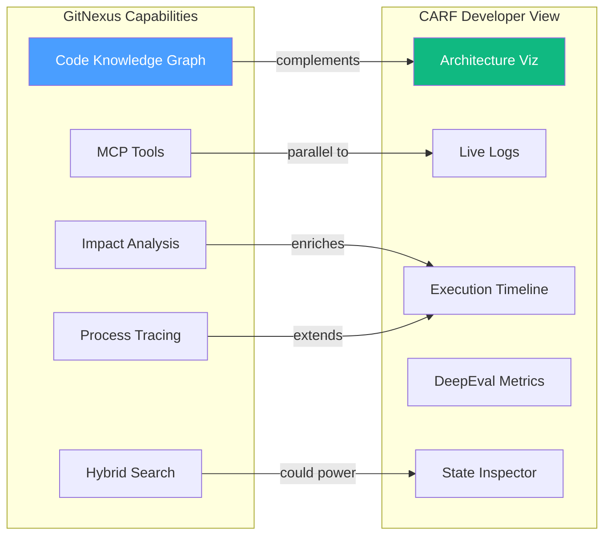

# GitNexus Analysis — Potential Benefits for CARF

> **Source:** [abhigyanpatwari/GitNexus](https://github.com/abhigyanpatwari/GitNexus)
> **License:** PolyForm Noncommercial 1.0.0
> **Date:** 2026-02-27

---

## What Is GitNexus?

GitNexus is a **zero-server code intelligence engine** that indexes any codebase into a knowledge graph — mapping every dependency, call chain, execution flow, and functional cluster — then exposes it through smart MCP tools so AI agents have full architectural awareness.

### Core Capabilities

| Capability | Description |
|---|---|
| **Knowledge Graph** | Builds a graph of files → classes → functions → calls → imports → clusters using Tree-sitter ASTs + KuzuDB |
| **Impact Analysis** | Blast-radius analysis with depth grouping and confidence scores |
| **Process Tracing** | Traces execution flows from entry points through call chains |
| **Hybrid Search** | BM25 + semantic search with Reciprocal Rank Fusion (RRF) |
| **360° Symbol View** | Categorized incoming/outgoing references + process participation |
| **Pre-Commit Analysis** | Maps git-diff changed lines to affected processes and risk levels |
| **Multi-File Rename** | Coordinated renaming with graph + text search awareness |
| **Cypher Queries** | Raw graph queries against the knowledge graph |
| **Wiki Generation** | LLM-powered documentation from the knowledge graph |
| **MCP Server** | 7 tools + 7 resources + 2 prompts + 4 agent skills via Model Context Protocol |

### Tech Highlights
- Runs entirely locally (CLI) or in-browser (WASM)
- KuzuDB embedded graph database with vector support
- Tree-sitter for multi-language AST parsing (9 languages including Python & TypeScript)
- Graphology-based clustering (community detection)

---

## CARF Developer View — Current State

The CARF Developer View currently provides:

| Feature | Implementation |
|---|---|
| **Architecture Visualization** | 4-layer cognitive stack (Router → Mesh → Services → Guardian) with real-time status |
| **Live Log Streaming** | WebSocket-based real-time log feed with layer/level filtering |
| **Execution Timeline** | Step-by-step trace of query processing through CARF layers |
| **Evaluation Metrics** | DeepEval metric visualization with Cynefin-aware recommendations |
| **State Inspector** | JSON deep-dive into system state, epistemic state, causal models |
| **Benchmarking** | Run domain-specific benchmarks across all 5 Cynefin domains |
| **Experience Buffer** | Historical query/response analysis |
| **Data Flow Panel** | Data layer inspection and flow visualization |

The developer view is **runtime-focused** — it monitors and debugs the cognitive pipeline as it processes queries. It does not provide structural code intelligence about the CARF codebase itself.

---

## Synergy Analysis — Where GitNexus Can Benefit CARF

### 1. Developer Productivity (Internal Tooling)

GitNexus can be used **by CARF developers** as a development accelerator:

| Use Case | Benefit |
|---|---|
| **Onboarding** | New developers instantly see how the Cynefin Router connects to the Agent Mesh, which services it calls, and what the Guardian layer monitors — all as a navigable graph |
| **Refactoring Safety** | Before modifying `CynefinRouter.classify()`, see its exact blast radius across 4 layers — which services break, which tests cover it |
| **Pre-Commit Analysis** | Before pushing changes, detect_changes shows which execution flows are affected and at what risk level |
| **Architecture Documentation** | Auto-generate wiki from the knowledge graph — always up-to-date architecture docs |
| **Debug Tracing** | Trace a bug through call chains from API router → service → model, seeing all dependencies |

> [!TIP]
> This is the **lowest-effort, highest-value** integration. Just run `npx gitnexus analyze` in the CARF repo and connect it to your IDE's MCP. No code changes needed.

### 2. Embedded Developer View Enhancement (Product Feature)

GitNexus capabilities could enhance the existing CARF Developer View as a **code-level complement** to the runtime view:

| Current (Runtime View) | Proposed Addition (Code Structure View) |
|---|---|
| "Query was routed to Complex domain" | "The routing function calls 3 classifiers and has 12 upstream dependents" |
| "Execution took 2.3s at Guardian layer" | "Guardian layer spans 5 modules, 23 functions, with 3 cross-community dependencies" |
| "DeepEval metric: relevancy = 0.85" | "The evaluation pipeline traces through 4 execution flows" |

This would add a **"Code Intelligence"** tab alongside the existing Architecture, Logs, Timeline, and Metrics tabs.

### 3. Platform Self-Awareness (Advanced)

CARF's architecture emphasizes **epistemic state** and **self-correcting loops**. GitNexus graph data could feed into:

| Concept | Integration |
|---|---|
| **Complexity Metrics** | Use cluster cohesion scores and dependency depth as inputs to the Cynefin Router's own domain classification of code changes |
| **Change Risk Assessment** | Map code changes to Cynefin domains (simple rename = Clear, cross-cluster refactor = Complex) |
| **Guardian Layer** | Use impact analysis data to validate that code changes respect architectural boundaries |

---

## Feasibility & Effort Matrix

| Integration Level | Effort | Value | Risk |
|---|---|---|---|
| **Level 1: Developer Tool** — Run GitNexus on CARF repo, use via IDE MCP | 🟢 Minutes | 🟢 High | 🟢 None |
| **Level 2: Developer View Tab** — Embed GitNexus web UI or API data in cockpit | 🟡 Days | 🟡 Medium | 🟡 Low — adds frontend dependency |
| **Level 3: Platform Self-Awareness** — Feed graph data into CARF's epistemic state | 🔴 Weeks | 🟡 Medium-High | 🟡 Medium — architectural changes |

---

## Concerns & Limitations

| Concern | Detail |
|---|---|
| **License** | PolyForm Noncommercial — **cannot be used commercially** without a separate license. This blocks Level 2 and 3 for a commercial CARF product |
| **Scope Mismatch** | GitNexus analyzes static code structure; CARF's developer view focuses on runtime behavior. They're complementary but different |
| **Language Coverage** | Supports Python and TypeScript (CARF's stack), so no issues there |
| **Maintenance** | Adding GitNexus as a dependency adds maintenance burden. The project is actively developed but young |
| **Overlap** | IDE-native features (Go to Definition, Find References) already cover some of GitNexus's value — the unique part is the precomputed graph intelligence |

> [!WARNING]
> The **PolyForm Noncommercial** license is the biggest blocker for any product-level integration. Level 1 (developer tool) is fine for internal use, but embedding it in the CARF product requires license negotiation.

---

## Recommendation

| Priority | Action |
|---|---|
| **Immediate** | Run `npx gitnexus analyze` on the CARF repo and add it as an MCP tool in your editor. Zero risk, instant benefit for development velocity |
| **Short-term** | Use the wiki generation to create always-current architecture documentation |
| **Evaluate** | If considering product embedding (Level 2+), contact the author about commercial licensing first |
| **Inspiration** | Even without direct integration, GitNexus's approach to precomputed relational intelligence and process tracing could inspire enhancements to CARF's own developer view — particularly adding code-level dependency awareness to complement the existing runtime monitoring |

---

## Architectural Alignment Summary

**Bottom line:** GitNexus is an excellent **developer productivity tool** for the CARF team right now (Level 1), with potential for deeper integration if the licensing is resolved. The code-level structural intelligence it provides is genuinely complementary to CARF's runtime monitoring capabilities.
